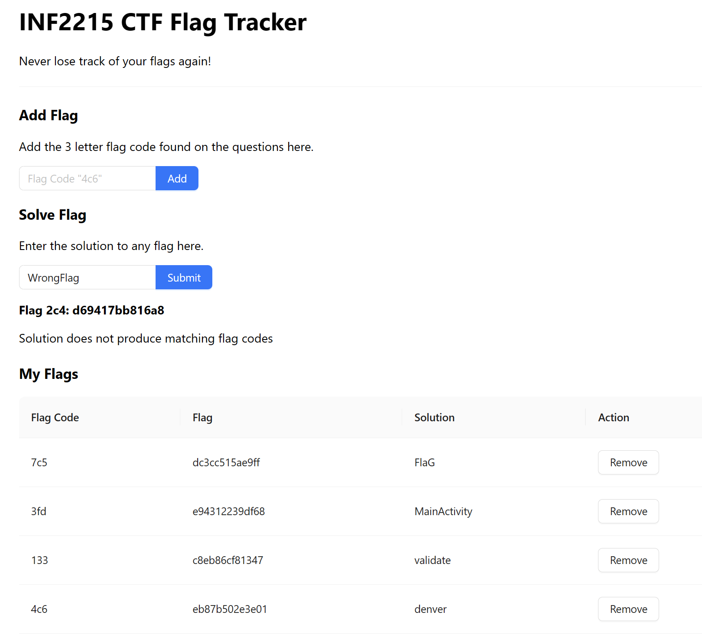

# ICT2215 CTF Flag Tracker
Never lose track of your flags again!

## How to get?

Download the zip file from [here](release/CtfFlagTracker.zip), unzip, click on index.html and you are ready to go!

If you don't trust me, clone the repository and run build it yourself 😒.

## How to use?

1. Enter all the flag codes (the 3 character code in the question) in the **Add Flag** section.
2. Add you solve the CTF, enter your solution in the **Solve Flag** section.
3. If a valid solution is entered, it will automatically be displayed in the table under the **My Flags** section.

## Disclaimer
The author is not liable for any loss of flags or marks from the use of this tracker.